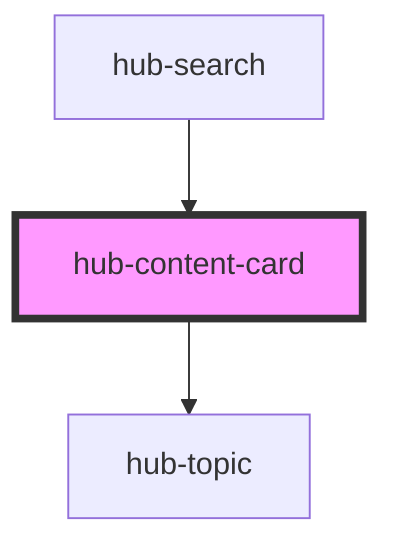

# hub-content-card

<!-- Auto Generated Below -->

## Properties

| Property      | Attribute | Description | Type     | Default                              |
| ------------- | --------- | ----------- | -------- | ------------------------------------ |
| `content`     | `content` |             | `string` | `"4f5c78bfe89a4304aec3a6cfd492d0cd"` |
| `contentItem` | --        |             | `IItem`  | `null`                               |
| `layout`      | `layout`  |             | `string` | `"horizontal"`                       |

## Dependencies

### Used by

 - [hub-search](../search)

### Depends on

- [hub-topic](../topic)

### Graph

----------------------------------------------

*Built with [StencilJS](https://stenciljs.com/)*
