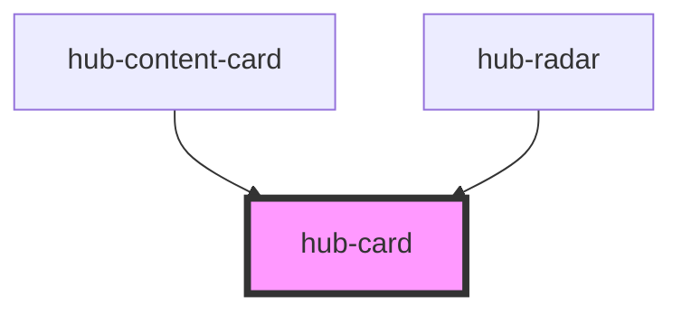

# hub-card

A rectangular card for showing content, optionally with an thumbnail image and link. 

<!-- Auto Generated Below -->

## Properties

| Property      | Attribute     | Description                    | Type                         | Default                    |
| ------------- | ------------- | ------------------------------ | ---------------------------- | -------------------------- |
| `contenttype` | `contenttype` |                                | `string`                     | `"Local Topic"`            |
| `description` | `description` |                                | `string`                     | `"Monday"`                 |
| `image`       | `image`       |                                | `string`                     | `undefined`                |
| `item`        | `item`        |                                | `string`                     | `""`                       |
| `layout`      | `layout`      | Specify the layout of the card | `"horizontal" \| "vertical"` | `"vertical"`               |
| `name`        | `name`        |                                | `string`                     | `"Trash Day"`              |
| `url`         | `url`         |                                | `string`                     | `"https://hub.arcgis.com"` |

## Dependencies

### Used by

 - [hub-content-card](../hub-content-card)
 - [hub-radar](../hub-radar)

### Graph

----------------------------------------------

*Built with [StencilJS](https://stenciljs.com/)*
