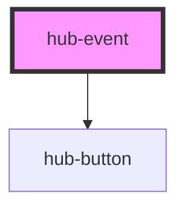

# hub-follow-button

<!-- Auto Generated Below -->

## Properties

| Property          | Attribute           | Description                                  | Type      | Default                    |
| ----------------- | ------------------- | -------------------------------------------- | --------- | -------------------------- |
| `attending`       | `attending`         |                                              | `boolean` | `undefined`                |
| `clientid`        | `clientid`          | ClientID to identify the app launching OAuth | `string`  | `undefined`                |
| `eventDate`       | `event-date`        |                                              | `string`  | `undefined`                |
| `eventGroupId`    | `event-group-id`    |                                              | `string`  | `undefined`                |
| `eventOrganizer`  | `event-organizer`   |                                              | `any`     | `undefined`                |
| `eventServiceUrl` | `event-service-url` |                                              | `string`  | `undefined`                |
| `eventtitle`      | `eventtitle`        | identifier for the ArcGIS Hub initiative     | `string`  | `undefined`                |
| `orgurl`          | `orgurl`            | url of the ArcGIS Online organization        | `string`  | `"https://www.arcgis.com"` |
| `session`         | `session`           | Serialized authentication information.       | `string`  | `undefined`                |

## Dependencies

### Depends on

- [hub-button](../hub-button)

### Graph

----------------------------------------------

*Built with [StencilJS](https://stenciljs.com/)*
