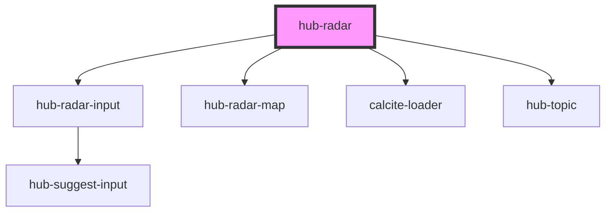

# hub-radar

<!-- Auto Generated Below -->

## Properties

| Property      | Attribute       | Description | Type      | Default     |
| ------------- | --------------- | ----------- | --------- | ----------- |
| `address`     | `address`       |             | `string`  | `undefined` |
| `mapCenter`   | `map-center`    |             | `string`  | `undefined` |
| `mapItem`     | `map-item`      |             | `any`     | `undefined` |
| `mapItemData` | `map-item-data` |             | `any`     | `undefined` |
| `mapZoom`     | `map-zoom`      |             | `string`  | `undefined` |
| `messages`    | `messages`      |             | `any`     | `undefined` |
| `showMap`     | `map`           |             | `boolean` | `true`      |
| `webmap`      | `webmap`        |             | `string`  | `undefined` |

## Dependencies

### Depends on

- [hub-radar-input](../radar-input)
- [hub-radar-map](../radar-map)
- calcite-loader
- [hub-topic](../topic)

### Graph

----------------------------------------------

*Built with [StencilJS](https://stenciljs.com/)*
