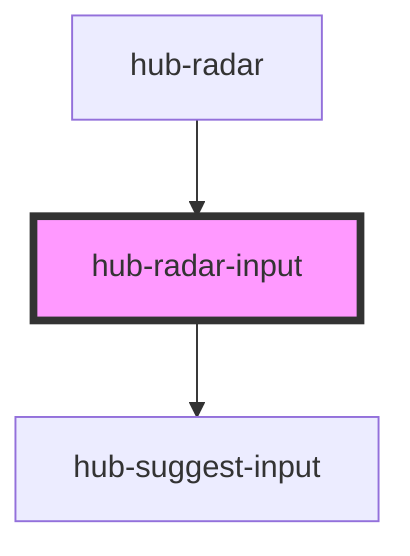

# hub-radar-input

<!-- Auto Generated Below -->

## Properties

| Property  | Attribute | Description                           | Type     | Default     |
| --------- | --------- | ------------------------------------- | -------- | ----------- |
| `address` | `address` | Default address to search             | `string` | `undefined` |
| `extent`  | `extent`  | Geographic extent limit for geocoding | `any`    | `undefined` |

## Events

| Event                 | Description                                             | Type               |
| --------------------- | ------------------------------------------------------- | ------------------ |
| `eventAddressUpdated` | Emits the {address, coordinates} of the geocoded result | `CustomEvent<any>` |

## Dependencies

### Used by

 - [hub-radar](../hub-radar)

### Depends on

- [hub-suggest-input](../suggest-input)

### Graph

----------------------------------------------

*Built with [StencilJS](https://stenciljs.com/)*
