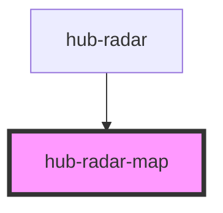

# hub-radar-map

<!-- Auto Generated Below -->

## Properties

| Property | Attribute | Description | Type     | Default     |
| -------- | --------- | ----------- | -------- | ----------- |
| `center` | `center`  |             | `string` | `undefined` |
| `webmap` | `webmap`  |             | `string` | `undefined` |
| `zoom`   | `zoom`    |             | `string` | `undefined` |

## Dependencies

### Used by

 - [hub-radar](../hub-radar)

### Graph

----------------------------------------------

*Built with [StencilJS](https://stenciljs.com/)*
