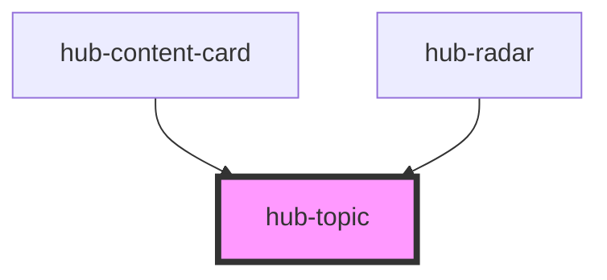

# hub-topic

<!-- Auto Generated Below -->

## Properties

| Property      | Attribute     | Description | Type     | Default                    |
| ------------- | ------------- | ----------- | -------- | -------------------------- |
| `contenttype` | `contenttype` |             | `string` | `"Local Topic"`            |
| `description` | `description` |             | `string` | `"Monday"`                 |
| `image`       | `image`       |             | `string` | `undefined`                |
| `item`        | `item`        |             | `string` | `""`                       |
| `layout`      | `layout`      |             | `string` | `"horizontal"`             |
| `name`        | `name`        |             | `string` | `"Trash Day"`              |
| `url`         | `url`         |             | `string` | `"https://hub.arcgis.com"` |

## Dependencies

### Used by

 - [hub-content-card](../content-card)
 - [hub-radar](../hub-radar)

### Graph

----------------------------------------------

*Built with [StencilJS](https://stenciljs.com/)*
